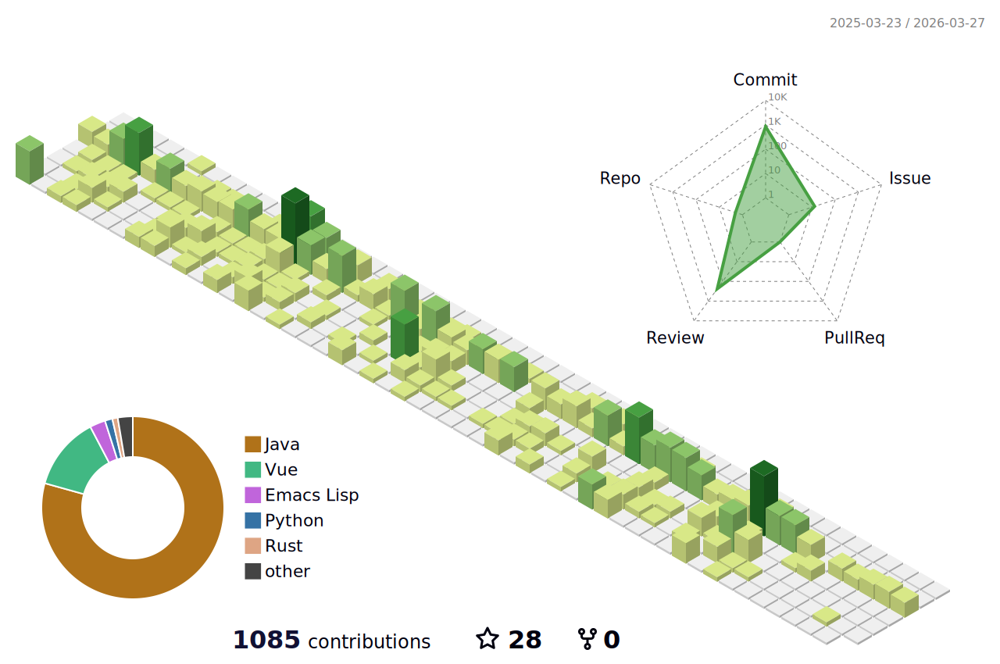

<p><em>A software engineer from <a href="https://zh.wikipedia.org/wiki/%E4%B8%AD%E5%8D%8E%E4%BA%BA%E6%B0%91%E5%85%B1%E5%92%8C%E5%9B%BD">China</a>. 😊</br>
</em></p>



```javascript
const aboutMe = {
   pronouns: "he" | "him",
   code: [Javascript, Typescript, Python, Java, Kotlin, Astro],
   technologies: {
      frontEnd: {
         js: ["Vue", "Angular"],
         css: ["Bootstrap"]
      },
      backEnd: {
         java: ["Spring"],
         js: ["Node"]
      },
      databases: ["MongoDB", "mySQL", "PostgreSQL"]
   }
};
```
</br></br>
<h2>💻 Some stats 💻</h2>


---

⭐️ From [conifercone](https://github.com/conifercone) inspired by [reeveng](https://github.com/reeveng)

